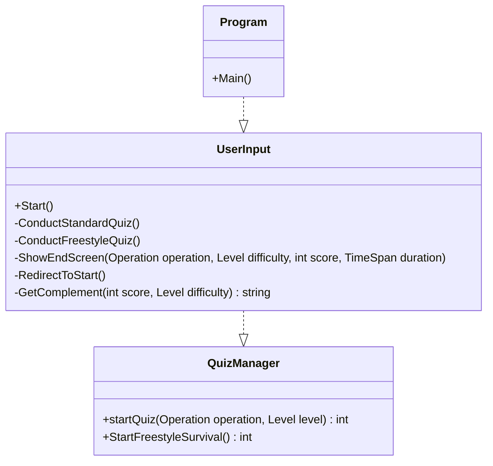
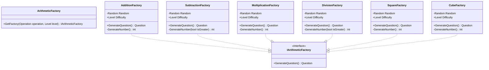
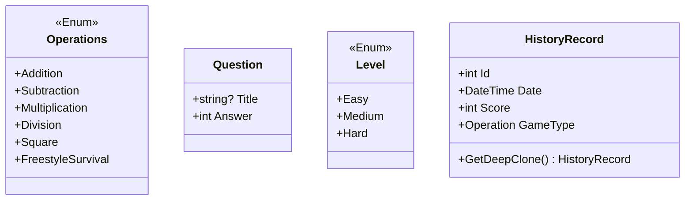
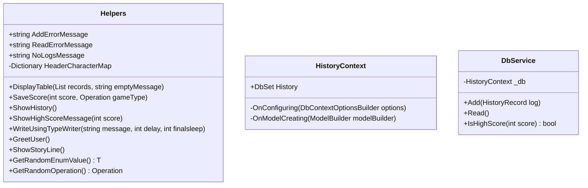


# Math Game Challenge   &nbsp;  
This repository was created as a part of a competition to showcase a simple math game.

## Getting Started
https://user-images.githubusercontent.com/85114885/184918386-dad460e0-49b6-4290-8011-30d969ccc597.mp4

## Motivation & Features
* This project is a command line-based game that helps you to get better at mental arithmetic.

* It covers addition, subtraction, multiplication, division and square and cube numbers. It uses the **abstract factory design pattern** which makes it easy to add new arithmetic operators into the game.

* You have three levels to choose from: easy, medium and hard. At the end of each session, your score is saved into an SQLite database, which is shown before the start of the game. Your name is saved is saved in a config file, so you won't be pestered by asking that everytime.

* As an added bonus, there's a **freestyle-survival mode**, where you can interleave the practice of different operators together, without worrying about the timer. You get only three chances though!

**It took me a great deal of time to make this happen, including the story lines, complements and not to mention all the other bells and whistles that come along with the game. An upvote would be greatly appreciated. Have fun!  😊**

## Program Flow

## Factories

## Entities

## Helpers

## Contribution
If you have any ideas,   [open an issue](https://github.com/CodeDreamer06/MathGameChallenge/issues/new)  and tell me what you think. If you'd like to contribute, please fork the repository and make changes as you'd like. Pull requests are warmly welcome.
1. Fork it
2. Create your feature branch (`git checkout -b feature/fooBar`)
3. Commit your changes (`git commit -am 'Add some fooBar'`)
4. Push to the branch (`git push origin feature/fooBar`)
5. Create a new pull request