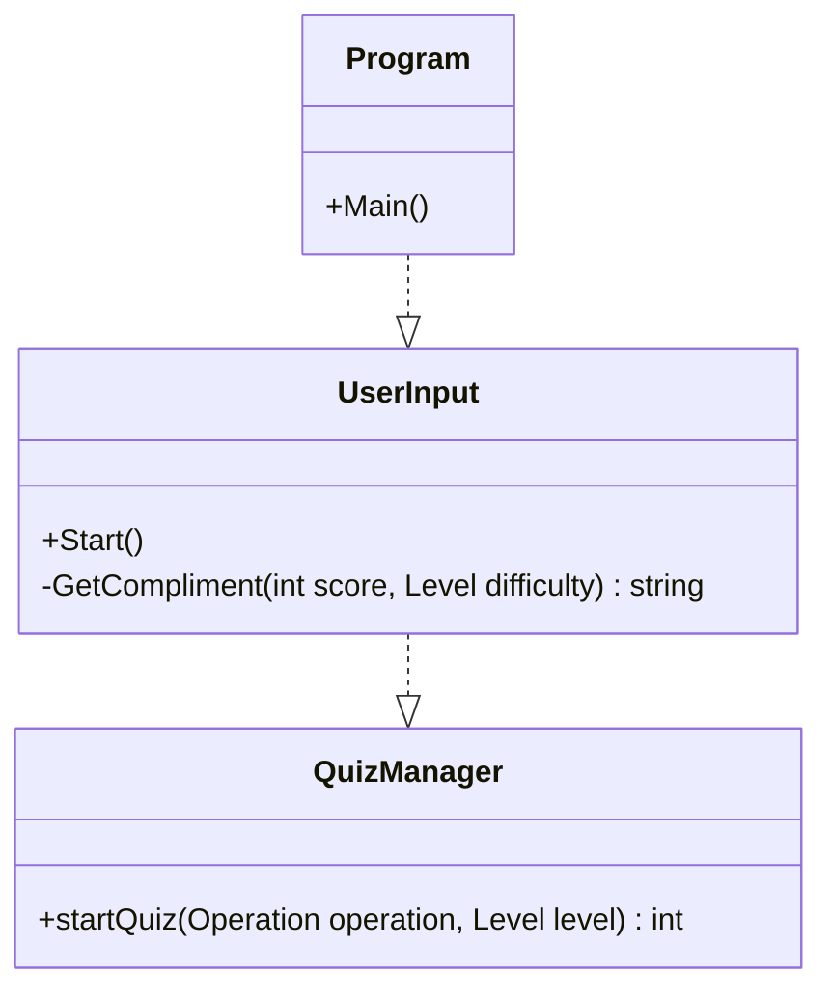
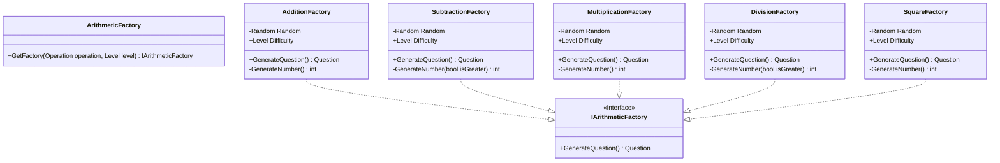
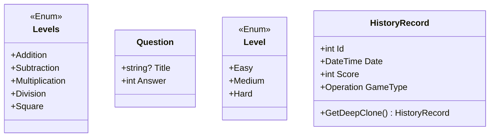
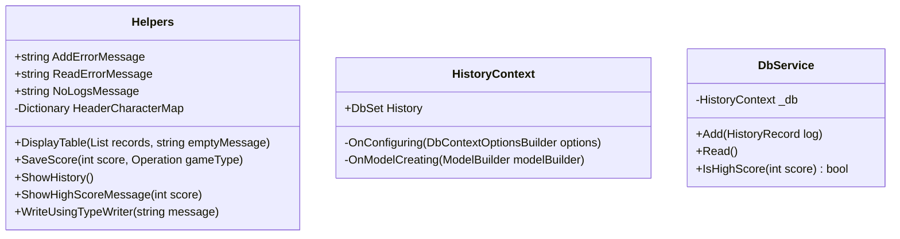

# Math Game Challenge   &nbsp;  
This repository was created as a part of a competition to showcase a simple math game.
## Program Flow UML

## Factories

## Entities UML

## Helpers UML

## Motivation & Features
* This project is a command line-based game that helps you to get better at mental arithmetic.

* It covers addition, subtraction, multiplication, division and square numbers. It uses the **abstract factory design pattern** which makes it easy to add new arithmetic operators into the game.

* You have three levels to choose from: easy, medium and hard. At the end of each session, your score is saved into an SQLite database, which is shown before the start of the game.

**Have fun!**
## Contribution
If you have any ideas,   [open an issue](https://github.com/CodeDreamer06/MathGameChallenge/issues/new)  and tell me what you think. If you'd like to contribute, please fork the repository and make changes as you'd like. Pull requests are warmly welcome.
1. Fork it
2. Create your feature branch (`git checkout -b feature/fooBar`)
3. Commit your changes (`git commit -am 'Add some fooBar'`)
4. Push to the branch (`git push origin feature/fooBar`)
5. Create a new pull request